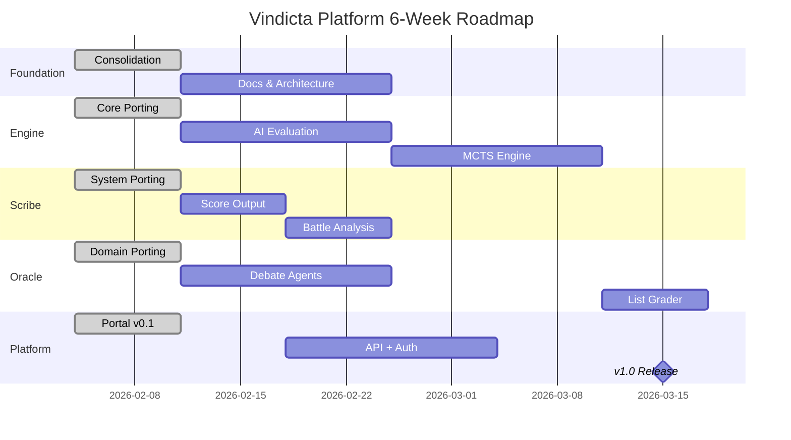

# Vindicta Platform — Master Roadmap

> **Last Updated**: 2026-02-10
> **Timeframe**: Feb 4 - Mar 17, 2026 (6 Weeks)
> **GitHub Organization**: https://github.com/vindicta-platform/

---

## 🎯 Platform Vision

*"Provably fair competitive gaming, powered by cryptographically auditable mechanics and AI-driven strategic insights."*

The Vindicta Platform is a comprehensive ecosystem for competitive tabletop wargaming, providing tools for game tracking, tactical AI analysis, and community engagement. The platform is organized into **7 domain-driven meso-repos**.

---

## 📊 Domain Portfolio Overview

| Domain Context | Repository                                                                                                                                  | Focus                           | Status   |
| :------------- | :------------------------------------------------------------------------------------------------------------------------------------------ | :------------------------------ | :------- |
| **Foundation** | [vindicta-foundation](https://github.com/vindicta-platform/vindicta-foundation)                                                             | Base models, Architecture, Docs | ✅ Active |
| **Engine**     | [vindicta-engine](https://github.com/vindicta-platform/vindicta-engine)                                                                     | Physics, Dice, Entropy, AI Core | ✅ Active |
| **Scribe**     | [warscribe-system](https://github.com/vindicta-platform/warscribe-system)                                                                   | Notation, Parsing, Transcripts  | ✅ Active |
| **Economy**    | [vindicta-economy](https://github.com/vindicta-platform/vindicta-economy)                                                                   | Ledger, GasTank, Quotas         | ✅ Active |
| **Oracle**     | [vindicta-oracle](https://github.com/vindicta-platform/vindicta-oracle)                                                                     | ML, Prediction, Debate Council  | 🟡 Beta   |
| **Platform**   | [Vindicta-Portal](https://github.com/vindicta-platform/Vindicta-Portal) / [Vindicta-API](https://github.com/vindicta-platform/Vindicta-API) | Frontend & API Gateway          | 🟡 Active |
| **Agents**     | [Vindicta-Agents](https://github.com/vindicta-platform/Vindicta-Agents)                                                                     | SDKs, Workflows, Swarm          | ✅ Active |

---

## 🗓️ 6-Week Release Schedule

### Week 1: Feb 4-10 — Foundation & Consolidation Sprint ✅

| Domain     | Key Deliverable                                       | Status     |
| :--------- | :---------------------------------------------------- | :--------- |
| **All**    | Platform consolidation (008): 29 repos → 7 meso-repos | ✅ Complete |
| Foundation | `VindictaModel` base, Architecture docs, C4 diagrams  | ✅ Complete |
| Engine     | Dice engine, Entropy buffer, AI core ported           | ✅ Complete |
| Scribe     | WARScribe notation, parser, transcripts ported        | ✅ Complete |
| Economy    | Ledger, GasTank, transactions ported                  | ✅ Complete |
| Oracle     | Debate Council, prediction models ported              | ✅ Complete |
| Agents     | Agent-Auditor SDK, workflows ported                   | ✅ Complete |
| Portal     | Firebase config, design system, CI/CD pipeline        | ✅ Complete |

### Week 2: Feb 11-17 — Feature Development

| Domain | Key Deliverable                                    |
| :----- | :------------------------------------------------- |
| Scribe | Score output pipeline (010-warscribe-score-output) |
| Engine | AI evaluation refinement, physics engine           |
| Oracle | DebateEngine activation, stub agents               |
| Portal | Auth integration, List Grader MVP                  |

### Week 3: Feb 18-24 — Integration Sprint

| Domain   | Key Deliverable                                |
| :------- | :--------------------------------------------- |
| Platform | API scaffold, dice/oracle endpoints            |
| Agents   | Quota prediction, SQLite journal               |
| Scribe   | Battle analysis pipeline (011-battle-analysis) |
| Economy  | Metering integration                           |

### Week 4: Feb 25 - Mar 3 — AI Sprint

| Domain   | Key Deliverable                |
| :------- | :----------------------------- |
| Oracle   | All debate agents active       |
| Engine   | MCTS foundation, search depth  |
| Scribe   | Audio pipeline integration     |
| Platform | Auth middleware, rate limiting |

### Week 5: Mar 4-10 — Polish & Integration

| Domain   | Key Deliverable                              |
| :------- | :------------------------------------------- |
| Agents   | Full integration with Oracle, Engine, Scribe |
| Engine   | MCTS engine, 3+ move depth                   |
| Portal   | Game Tracker MVP, PWA setup                  |
| Platform | Integration tests, OpenAPI docs              |

### Week 6: Mar 11-17 — v1.0 Release Week ⭐

| Domain         | Key Deliverable                              |
| :------------- | :------------------------------------------- |
| **Portal**     | PWA install, AI overlay, production ready    |
| **Platform**   | Rate limits, Free Tier compliance, full docs |
| **Foundation** | 90%+ test coverage                           |
| Oracle         | List Grader API, Upset Detector              |

---

## 🎯 Major Milestones

---

## 📈 Success Metrics

| Metric                       | Target       | Deadline |
| :--------------------------- | :----------- | :------- |
| Portal Lighthouse Score      | ≥95          | Mar 15   |
| Test Coverage (Core domains) | ≥80%         | Mar 15   |
| v1.0.0 Releases              | 3 domains    | Mar 15   |
| Meso-repo consolidation      | 7/7 complete | ✅ Done   |

---

## 🔗 Related Resources

- [Daily Schedule](./PROJECT_SCHEDULE.md) — Detailed daily task allocations
- [PR Dashboard](https://github.com/orgs/vindicta-platform/projects/3) — Active pull requests
- [Platform Docs](https://vindicta-platform.github.io/Platform-Docs/) — Public documentation

---

*This is the source of truth for Vindicta Platform release planning. Maintained by the Product Owner.*
