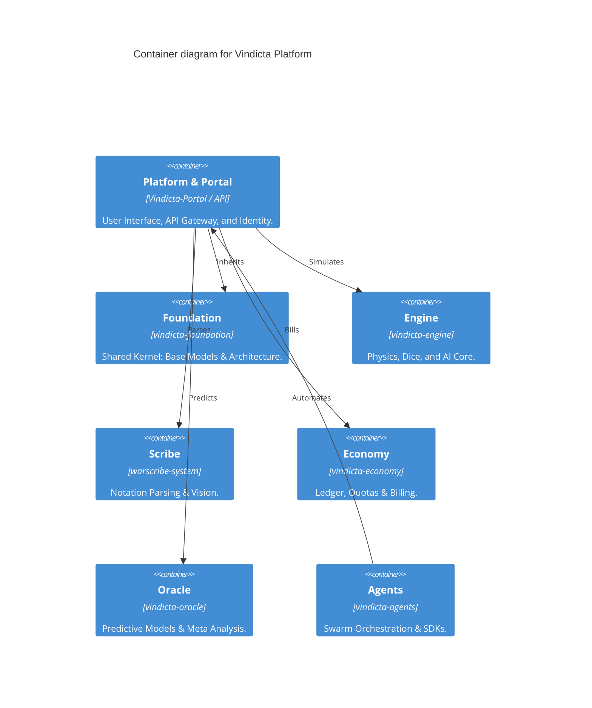

<div align="center">

# ⚔️ Vindicta Platform

*Provably fair competitive gaming, powered by cryptographically auditable mechanics and AI-driven strategic insights.*

[](https://vindicta-platform.web.app)
<br/>
[](https://vindicta-platform.github.io/Platform-Docs/)
[](https://github.com/vindicta-platform/.github/blob/main/ROADMAP.md)
[](https://github.com/orgs/vindicta-platform/projects/3)

</div>

---

## 🗺️ System Architecture

The Vindicta Platform consolidates 7 domain contexts into a unified e-sports ecosystem.



---

## ⚡ Quick Start

Get up and running with our **"Hello World"** examples in the [Orchestrator Repository](https://github.com/vindicta-platform/vindicta-platform/tree/main/examples).

```bash
# Clone the orchestrator
git clone --recurse-submodules https://github.com/vindicta-platform/vindicta-platform.git
cd vindicta-platform

# Run the Dice Engine example
uv run examples/dice_roll.py

# Run the WARScribe Action example
uv run examples/warscribe_actions.py
```

---

## ⚔️ Choose Your Class

Join the development squad that matches your skills and interests.

| Class                | Skills                    | Quest                                          | Realm                                                                     |
| :------------------- | :------------------------ | :--------------------------------------------- | :------------------------------------------------------------------------ |
| **Tech-Priest**      | Python, Math, Probability | Build the physics engine and entropy proofs.   | [vindicta-engine](https://github.com/vindicta-platform/vindicta-engine)   |
| **Logos Historian**  | NLP, Vision, Parsing      | Decode WARScribe notation and parse rosters.   | [warscribe-system](https://github.com/vindicta-platform/warscribe-system) |
| **Meta-Seer**        | ML, Data Science, Stats   | Train predictive models and evaluating lists.  | [vindicta-oracle](https://github.com/vindicta-platform/vindicta-oracle)   |
| **Void Banker**      | DeFi, Ledgers, SQL        | Manage the atomic economy and gas tanks.       | [vindicta-economy](https://github.com/vindicta-platform/vindicta-economy) |
| **Portal Architect** | React, UX/UI, Design      | Craft the player experience and visualization. | [Vindicta-Portal](https://github.com/vindicta-platform/Vindicta-Portal)   |

---

## 📦 Domain Contexts

| Domain         | Repository                                                                      | Status   | Stack                    |
| :------------- | :------------------------------------------------------------------------------ | :------- | :----------------------- |
| **Foundation** | [vindicta-foundation](https://github.com/vindicta-platform/vindicta-foundation) | ✅ Active | Python 3.12, Pydantic V2 |
| **Engine**     | [vindicta-engine](https://github.com/vindicta-platform/vindicta-engine)         | ✅ Active | Python 3.12, Pydantic V2 |
| **Scribe**     | [warscribe-system](https://github.com/vindicta-platform/warscribe-system)       | ✅ Active | Python 3.12, Pydantic V2 |
| **Economy**    | [vindicta-economy](https://github.com/vindicta-platform/vindicta-economy)       | ✅ Active | Python 3.12, Pydantic V2 |
| **Oracle**     | [vindicta-oracle](https://github.com/vindicta-platform/vindicta-oracle)         | 🟡 Beta   | Python 3.12, Pydantic V2 |
| **Platform**   | [Vindicta-Portal](https://github.com/vindicta-platform/Vindicta-Portal)         | 🟡 Active | Vite 7+, Cloud Run       |
| **Agents**     | [Vindicta-Agents](https://github.com/vindicta-platform/Vindicta-Agents)         | ✅ Active | Python 3.12, Pydantic V2 |

<details>
<summary><strong>📁 Archived Legacy Repos</strong></summary>

The following repositories have been consolidated into the domain contexts above:
*   `Vindicta-Core` → `vindicta-foundation`
*   `Dice-Engine`, `Primordia-AI` → `vindicta-engine`
*   `WARScribe-Core`, `WARScribe-Parser` → `warscribe-system`
*   `Economy-Engine`, `Atomic-Ledger-Py` → `vindicta-economy`
*   `Meta-Oracle` → `vindicta-oracle`

</details>

---

<div align="center">

*Built with 🎲 by the Vindicta Team*

</div>
